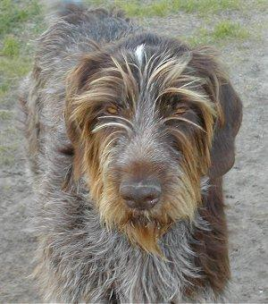
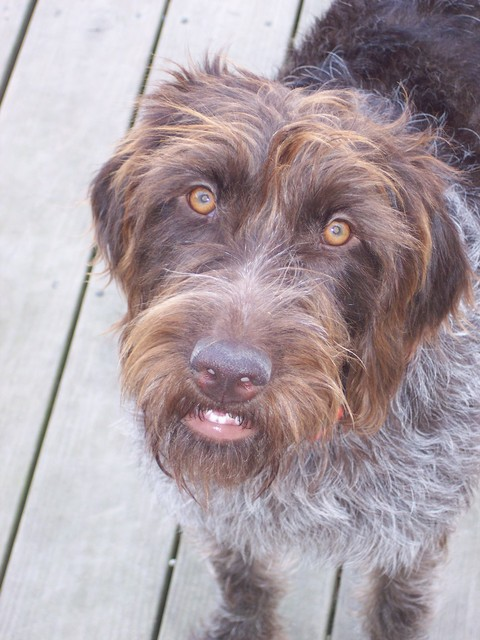

 

## Introduction
 

# Dog Breed Classifier

## Table of Contents
- [Project Overview](#overview)
- [Problem Statement](#statement)
- [Metrics](#metrics)
- [Data Exploration and Visualization](#explore)
- [Data Preprocessing](#preprocess)
- [Implementation](#implement)
  - [Step 0](#step0): Import Datasets
  - [Step 1](#step1): Detect Humans
  - [Step 2](#step2): Detect Dogs
  - [Step 3](#step3): Create a CNN to Classify Dog Breeds (from Scratch)
  - [Step 4](#step4): Create a CNN to Classify Dog Breeds (using Transfer Learning)
  - [Step 5](#step5): Write the Algorithm
  - [Step 6](#step6): Test the Algorithm
- [Model Evaluation and Validation](#eval)
- [Justification](#just)
- [Reflection](#reflection)
- [Improvement](#improvement)

[Back to Table of Content](#index)

## Project Overview
 | 

 If you look at the two dog pictures above, you might thought they are the same breed. But, you would be surprised to know that they are quite different. The left one is Brittany, and the right one Welsh Springer Spaniel. There are thousands of different dog breeds in the world. Some of them are so visually distinct  that it is easily possible to tell their breeds from their images. But, for some breeds like the above image pair, it is quite difficult to distinguish them. In order to solve this problem, I want to leverage the state of art of image classification model on Imagenet to teach computer to predict dog's breed from an image by training it using 6680 images of 133 breeds, 835 images for validation and 836 images for testing.  

[Back to Table of Content](#index)

## Problem Statement
 Aside from the big problem of dog breed classification, I would like to tackle two minor but interesting problems as well such as human face detection and dog detection using computer vision and machine learning techniques. Using these three solutions. This application  will accept any user-supplied image as input. If a dog is detected in the image, it will provide an estimate of the dog's breed. If a human is detected, it will provide an estimate of the dog breed that is most resembling. If it detects neither a dog nor a human, it will give an appropriate error message.  

 

[Back to Table of Content](#index)

## Metrics
Since I'm dealing with a multi-classification problem here and the data is slightly imbalanced, I use accuracy evaluation metric and negative log-likelihood loss function. The main objective in a learning model is to minimize the loss function's value with respect to the model's parameters by changing the weight vector values through different optimization methods, such as backpropagation in neural networks.

Loss value implies how well or poorly a certain model behaves after each iteration of optimization. Ideally, one would expect the reduction of loss after each, or several, iteration(s).

The accuracy of a model is usually determined after the model parameters are learned and fixed and no learning is taking place. Then the test samples are fed to the model and the number of mistakes (zero-one loss) the model makes are recorded, after comparison to the true targets. Then the percentage of misclassification is calculated.

For example, if the number of test samples is 1000 and model classifies 950 of those correctly, then the model's accuracy is 95.0%. [Ref](https://stackoverflow.com/questions/34518656/how-to-interpret-loss-and-accuracy-for-a-machine-learning-model)
 

 

[Back to Table of Content](#index)

## Data Exploration and Visualization
From the train, test and valid dataset of dog images, I get the following distribution and statistics:

 

[Back to Table of Content](#index)

## Data Preprocessing
Each image in the train, valid and text dataset goes thorugh a number of preprocessing steps:

1. Train and Valid Dataset images goes through a series of transforms.Resize(256), transforms.RandomResizedCrop(224), transforms.RandomHorizontalFlip()
1. Test Dataset images goes through a series of transforms.Resize((224, 224) 
1. Normalize: Each image is normalized by mean=[0.485, 0.456, 0.406] and std=[0.229, 0.224, 0.225]

 

[Back to Table of Content](#index)

## Implementation
The implementation of the project is divided into following steps:

### Step 0: Import Datasets

I downloaded dog and human datasets, unzip the folders and put them in the project home directory. 

 

[Back to Table of Content](#index)

### Step 1: Detect Humans

I use OpenCV's implementation of Haar feature-based cascade classifiers to detect human faces in images. OpenCV provides many pre-trained face detectors, stored as XML files on github. I downloaded one of these detectors and stored it in the haarcascades directory. 
Before using any of the face detectors, it is standard procedure to convert the images to grayscale. The detectMultiScale function executes the classifier stored in face_cascade and takes the grayscale image as a parameter. 

 

[Back to Table of Content](#index)

### Step 2: Detect Dogs
I use a pre-trained VGG16 model to detect dogs in images. The code cell below downloads the VGG-16 model, along with weights that have been trained on ImageNet, a very large, very popular dataset used for image classification and other vision tasks. ImageNet contains over 10 million URLs, each linking to an image containing an object from one of [1000 categories](https://gist.github.com/yrevar/942d3a0ac09ec9e5eb3a).While looking at the [dictionary](https://gist.github.com/yrevar/942d3a0ac09ec9e5eb3a), you will notice that the categories corresponding to dogs appear in an uninterrupted sequence and correspond to dictionary keys 151-268, inclusive, to include all categories from 'Chihuahua' to 'Mexican hairless'. Thus, in order to check to see if an image is predicted to contain a dog by the pre-trained VGG-16 model, I need only check if the pre-trained model predicts an index between 151 and 268 (inclusive).

[Back to Table of Content](#index)

### Step 3: Create a CNN to Classify Dog Breeds (from Scratch)
Now that I have functions for detecting humans and dogs in images, I need a way to predict breed from images. In this step, I create a CNN that classifies dog breeds. I create a CNN from scratch to attain a test accuracy of at least 1%.

[Back to Table of Content](#index)

### Step 4: Create a CNN to Classify Dog Breeds (using Transfer Learning)
To reduce training time without sacrifysing accuracy, I have used the pre-trained VGG-16 model as a fixed feature extractor, where the last convolutional output of VGG-16 is fed as input to the model. I only add a global average pooling layer and a fully connected layer, where the latter contains one node for each dog category and is equipped with a softmax.

[Back to Table of Content](#index)

### Step 5: Write the Algorithm
In this step, I write an algorithm that accepts a file path to an image and first determines whether the image contains a human, dog, or neither. Then,
* if a dog is detected in the image, return the predicted breed.
* if a human is detected in the image, return the resembling dog breed.
* if neither is detected in the image, provide output that indicates an error. 

[Back to Table of Content](#index)

### Step 6: Test the Algorithm
In this step, I test the algorithm at least six images on my computer, use three human and three dog images.

[Back to Table of Content](#index)

 

[Back to Table of Content](#index)

## Model Evaluation and Validation
Now, I the comparison of performance metrics of two of the models using the transfer learning techniques. 

|         Model          |      Accuracy     | 
| :--------------------: | :---------------: |
|    Pretrained VGG16    |      85.00%       |

The performance can be further improved by using some other pretrained model such as Densenet, Resnet or Inception models.
 

## Justification
Due to less number of dog images of certain breeds, the model finds it difficult to predict some breeds.  
I have observed that the model couldn’t classify between Great pyrenees and Kuvasz, which both are white, big, and fluffy.   
[Great pyrenees]| [Kuvasz]   
Also I have found the model fails to correctly classify german wirehaired pointer and wirehaired pointing griffon which look quite similar.   
[german wirehaired pointer]| [wirehaired pointing griffon]   
It also couldn’t distinguish between Mastiff and Bullmastiff, which is a mix between a bulldog and a mastiff.
  
[Bulldog]|[Mastiff]|[Bullmastiff]  

 

[Back to Table of Content](#index)

### Reflection

These are the intersting or difficult aspects of this present application:
1. __GPU TRAINING__: The training requires a lot of computational power and hence it is impossible to do the project without GPU. I have done the training in my local laptop equipped with GTX 1060 GPU. Even though it has 6GB RAM, but it happened that when I tried to train two transfer models on a same notebook, the GPU ran out of memory. So I train different transfer models in different notebooks to overcome the situation.
1. __KERAS vs PYTORCH__: Due to my prevoius familiarity with Pytorch, I have implemented all model using Pytorch instead of Keras.  

[Back to Table of Content](#index)

### Improvement

These are the improvement ideas on this present application:
1. __TRY DIFFERENT HYPERPARAMETERS__: Try different hyper-parameters as weight initialization, dropout, learning rate, batch size and optimizer.
1. __AUGMENT THE TRAINING DATA__: Augmenting the training and/or validation set might help improve model performance.
1. __DIFFERENT PRETRAINED MODEL__: In the future project, I would like to use other pretrained models such as Densenet, Resnet or Inception. 
1. __OVERLAY DOG EARS ON DETECTED HUMAN HEADS:__ Overlay a Snapchat-like filter with dog ears on detected human heads. I can determine where to place the ears through the use of the OpenCV face detector, which returns a bounding box for the face. If I would also like to overlay a dog nose filter, some nice tutorials for facial keypoints detection exist [here](https://www.kaggle.com/c/facial-keypoints-detection/details/deep-learning-tutorial).
1. __ADD FUNCTIONALITY FOR DOG MUTTS__: Currently, if a dog appears 51% German Shephard and 49% poodle, only the German Shephard breed is returned. The algorithm is currently guaranteed to fail for every mixed breed dog. Of course, if a dog is predicted as 99.5% Labrador, it is still worthwhile to round this to 100% and return a single breed; so, you will have to find a nice balance.

[Back to Table of Content](#index)

### Dog detection and Breed Prediction

### Dog detection and Breed Prediction

### Dog detection and Breed Prediction

### Human or Unknown Detection

### Human or Unknown Detection

### Human or Unknown Detection

 

[Back to Table of Content](#index)