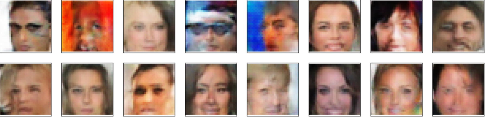
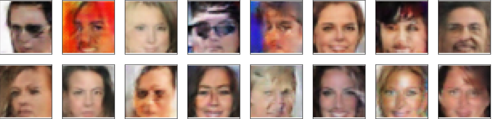
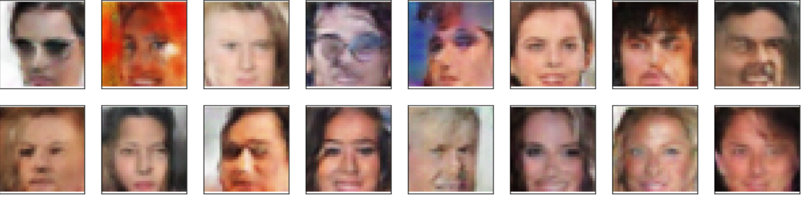
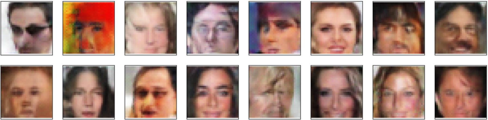

# Face Generation

## Introduction
In this project, I use generative adversarial networks to generate new images of faces. The model is trained using celebrity images for 60 epochs to generate some realistic face images by its own. You can see from the images below that as you train the model for more epochs, it generates realistic images with more authentic features.

### Images generated after epoch: 5


### Images generated after epoch: 10



### Images generated after epoch: 20



### Images generated after epoch: 40



### Images generated after epoch: 60



## Getting the project files
The project files can be found in Udacity [public GitHub repo](https://github.com/yao23/DeepLearning_Playground), in the project-face-generation folder.

```
git clone https://github.com/yao23/DeepLearning_Playground.git
```

Since I need GPU support in this project, so I decided to complete our project using the provided, in-classroom project notebook; this will just require that I run the project notebook, and download the complete files later on.

## Structure of Project
* dlnd_face_generation.ipynb: Notebook of the project
* problem_unittests.py: Test file for different TODO functions in the project
* dlnd_face_generation.html: HTML version of the notebook
* images folder: different epochs outputs
